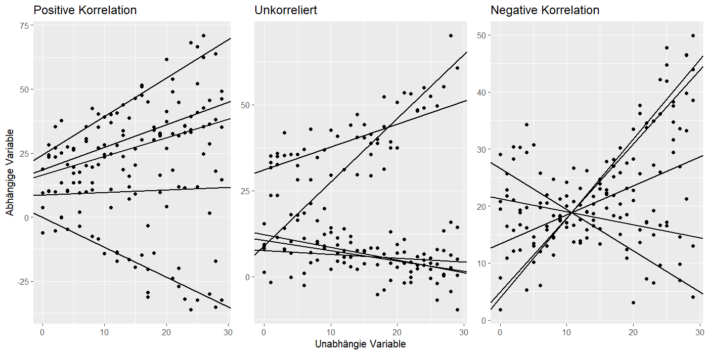

Hierarchische Lineare Modelle (HLM) ermöglichen es hierarchische Datenstrukturen in der Analyse zu berücksichtigen. Dabei kann zwischen *Random Intercept* und *Random Intercept and Slope* Modellen unterschieden werden. Wie bereits ihr Name vermuten lässt, werden in diesen Modellen der Achsenabschnitt und/oder die Steigung variiert. 

Betrachten wir ein einfaches *Random Intercept* Modell mit zwei Levels und einem Prädiktor. Dieses Modell wird mit der folgenden Gleichung beschrieben:
$$
\begin{split}	
 \text{Level 1:}  \qquad 	y_{ij} 		  & = \beta_{0j} + \beta_{1}x_{ij} + \epsilon_{ij}\\\\\
 \text{Level 2:} 	\qquad 	\beta_{0j} 	& = \gamma_{00} + U_{0j}\\\\\
 							            \beta_{1}   & = \gamma_{10}
\end{split}	
$$
Die Gleichung auf Level-1 sieht einer Gleichung eines normalen linearen Modells sehr ähnlich. Eine abhängige Variable $y_{ij}$ wird durch zwei Regressionskoeffizienten $\beta_{0j}$ und $\beta_{1}$, einer unabhängigen Variablen $x_{ij}$ und dem Residuum $\epsilon_{ij}$ beschrieben. Dabei kann man aber erkennen, dass der Regressionskoeffizienten des Achsenabschnittes $\beta_{0j}$ von der Gruppe $j$ Abhängig ist. Auf Level-2 werden nun die beiden Gleichungen für die Regressionskoeffzienten aufgeführt. Der Regressionskoeffizienten für den Achsenabschnitt wird nun durch den Gesamtmittelwert $\gamma_{00}$ und eine zufällige Abweichung $U_{0j}$ der Gruppe $j$ beschrieben. Hier ist aber zu beachten, dass HLMs diese zufällige Abweichung nicht direkt schätzt, sondern nur ihre Varianz. Erst aus dieser geschätzten Varianz, können dann die Gruppenspezifischen Achsenabschnitte berechnet werden. Da es sich hier nur um ein *Random Intercept* Modell handelt, ist der Regressionskoeffizient der Steigung $\beta_{1}$ nicht von der Gruppe $j$ abhängig und entspricht für alle Gruppen der Gesamtsteigung $\gamma_{10}$.

In der Praxis ist es aber oft so, dass sich nicht nur der Achsenabschnitt zwischen den Gruppen unterscheidet sondern auch die Steigung. Mit einem *Random Intercept and Slope* Modell können diese Unterschiede berücksichtigt werden. Betrachten wir die folgenden Gleichung des *Random Intercept and Slope* Modells, kann man erkennen, dass nun der Regressionskoeffizient $\beta_{1j}$ ebenfalls von der Gruppe $j$ abhängig ist:
$$
\begin{split}	
 \text{Level 1:}  \qquad 	y_{ij} 		  & = \beta_{0j} + \beta_{1j}x_{ij} + \epsilon_{ij}\\\\\
 \text{Level 2:} 	\qquad 	\beta_{0j} 	& = \gamma_{00} + U_{0j}\\\\\
 							            \beta_{1j}   & = \gamma_{10} + U_{1j}
\end{split}	
$$
Der Regressionskoeffizient der Steigung $\beta_{1j}$ enthält nun ebenfalls eine zufällige Abweichung $U_{1j}$ von der die Gruppe $j$ von der Gesamtsteigung $\gamma_{10}$ abweicht. Bei einem *Random Intercept and Slope* Modell kann es sein, dass ein erhöhter Achsenabschnitt mit einer erhöhten Steigung einhergeht. In diesem Fall spricht man von einer positiven Korrelation zwischen Achsenabschnitt und Steigung. Diese beiden Koeffizienten müssen aber nicht zwingend positiv miteinander korreliert sein. Es gibt auch Situationen in denen sie beispielsweise unkorreliert sind oder eine gar negative Korrelation aufweisen. In der folgenden Abbildung sind diese Zusammenhänge noch einmal visualisiert.

HLMs können also die Gruppenzugehörigkeit sowohl im Achsenabschnitt als auch in der Steigung berücksichtigen und können dementsprechend eine effiziente Methode sein um hierarchische Daten zu analysieren. In meiner Masterarbeit werden HLMs noch weiter anhand eines Beispieles erklärt. Für eine ausführliche Einführung in HLMs empfiehle ich das Lehrbuch von Snijders und Bosker (2012).

